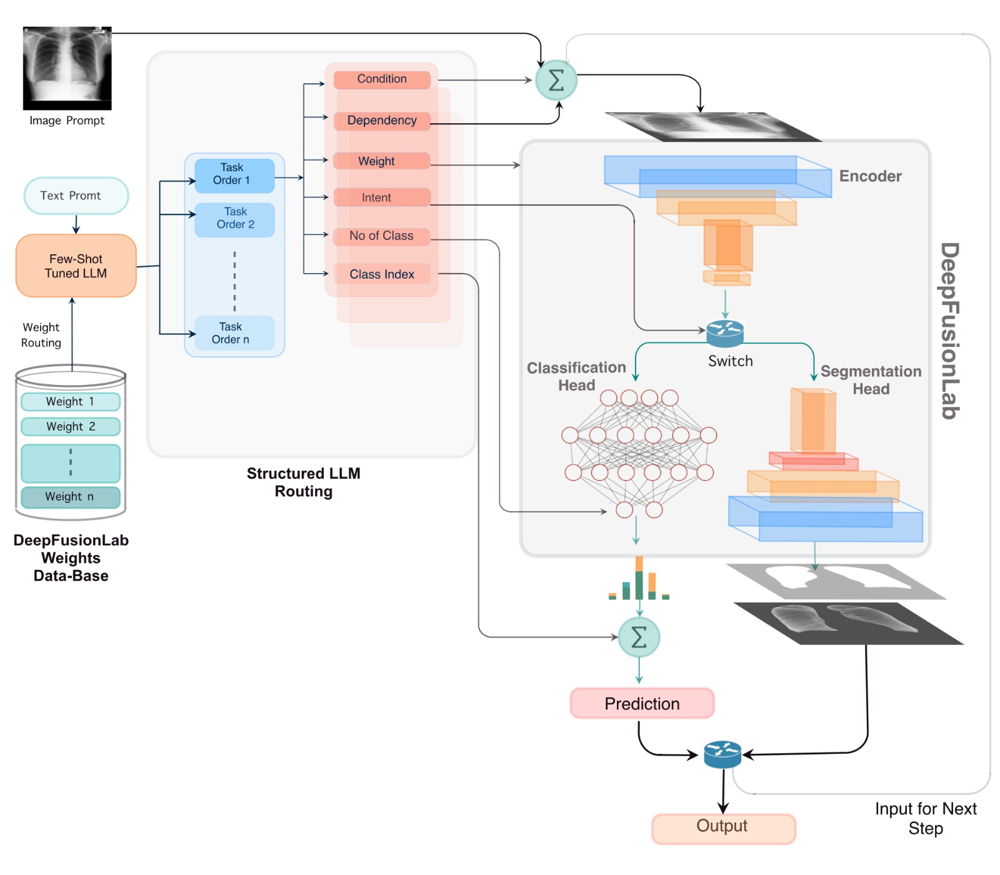
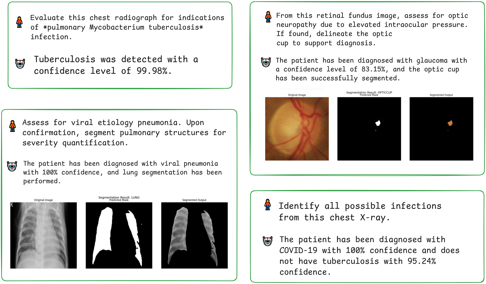
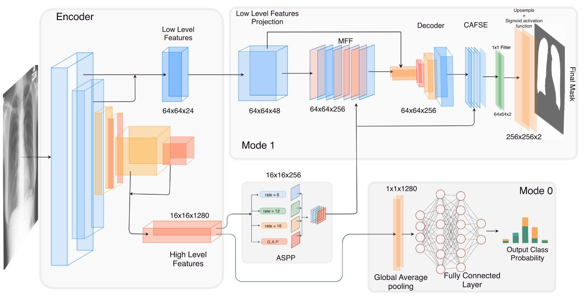

# 🧠 MedPrompt  
### **LLM-CNN Fusion with Weight Routing for Medical Image Segmentation and Classification**

MedPrompt is a unified, prompt-driven medical image analysis framework that fuses a **few-shot Prompted Large Language Model** with a lightweight yet powerful CNN architecture (**DeepFusionLab**) to perform **segmentation** and **classification** directly from **natural language instructions**.

Traditional medical AI systems are mostly task-specific; a model is typically capable of either classification or segmentation, and even then only for a single target organ or disease. Recently, interactive models and foundation models have emerged that are trained across many datasets and can segment multiple organs based on user prompts. However, these models remain limited in several ways: they are not designed for fully text-driven medical image segmentation, they cannot perform both classification and segmentation within the same unified framework, and their performance on individual tasks often lags behind well-optimized task-specific models. Furthermore, they lack the ability to interpret complex medical instructions, execute conditional logic, or dynamically choose the correct model for a given task.

To overcome these limitations, we propose MedPrompt, a unified system that combines the power of LLM for text interpretation with the accuracy of CNN for image analysis. MedPrompt interprets natural-language instructions, constructs task pipelines, and uses dynamic weight routing to automatically select the appropriate pretrained models, enabling flexible, high-accuracy classification and segmentation from a single prompt.

---

  

---

  

---

## 🚀 Key Features

### 🔹 **1. Natural Language → Structured Workflow**
MedPrompt automatically:
- Parses users' text prompts  
- Detects intent (classification / segmentation)  
- Normalizes targets (e.g., lung, retina, TB, pneumonia)  
- Generates JSON-based task pipelines  
- Handles multi-step and conditional workflows  

**Example prompt:**
"Check for tuberculosis. If detected, segment the lungs."

---

## 🔹 **2. Dynamic Weight Routing**
A novel routing mechanism that:
- Matches tasks to pretrained weights  
- Uses semantic similarity scoring  
- Allows plug-and-play expansion with new weights  
- Avoids retraining  

> Add new weights → MedPrompt automatically routes them.

---

## 🔹 **3. DeepFusionLab – A Dual-Mode CNN**

DeepFusionLab supports:
- **Classification** (mode = 0)  
- **Segmentation** (mode = 1)  

  

---

## 🔹 **4. Strong Performance Across 19 Datasets**

| Task | Performance |
|------|-------------|
| Lung Segmentation | **Dice ≈ 0.9856** |
| TB Classification | **F1 ≈ 0.9744** |
| Polyp Segmentation | **Dice ≈ 0.9451** |
| Retinal Vessel Segmentation | **Dice ≈ 0.8106** |
| COVID-19 Classification | **Acc ≈ 0.9969** |

---

## 🔹 **5. Fast & Deployment-Ready**
- **97%** prompt-interpretation correctness  
- **~2.5s** CPU end-to-end latency (LLM is called from Groq) 

---

# 📁 Repository Structure
MedPrompt/
│

├── classification-training-for-deepfusionlab.ipynb # Notebook on how to train DeepFusionLab on Classification Datasets

├── medprompt-framework.ipynb #Running Medprompt

├── segmentation-training-for-deepfusionlab.ipynb # Notebook on how to train DeepFusionLab on Segmentation Datasets

